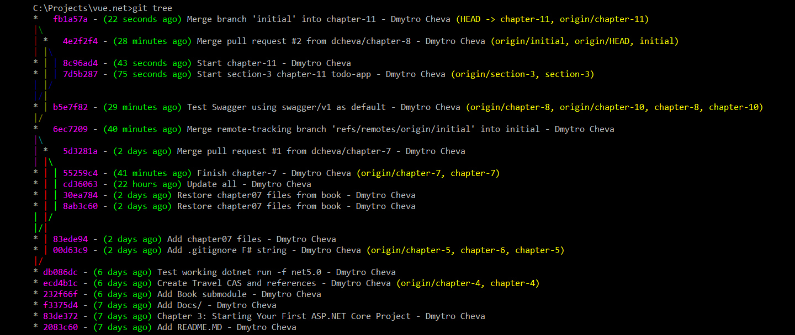

# vue.net GitHub repo 



## fixes and notes
### Node error:0308010C:digital envelope routines::unsupported

	When running JavaScript applications with Node, you might see the following error:
	Error: error:0308010C:digital envelope routines::unsupported
	https://sebhastian.com/error-0308010c-digital-envelope-routines-unsupported/

Add --openssl-legacy-provider flag to your build script
As an alternative solution, you can add the --openssl-legacy-provider flag to the build script defined in package.json.

The Open SSL legacy provider is a collection of legacy algorithms that’s no longer in common use, such as MD2, MD4, MDC2, etc.

You can add the flag to enable these legacy algorithms. Here are some examples for Create React App and vue-cli apps:

```
// For React:
{
  "scripts": {
    "start": "react-scripts start --openssl-legacy-provider"
  }
}

// For Vue:
{
  "scripts": {
    "serve": "vue-cli-service serve --openssl-legacy-provider"
  },
}
```

If you see an error saying Error: Unknown argument: openssl-legacy-provider, then you can set the NODE_OPTIONS environment variable before running the build command.

### Depending on your terminal, run one of the commands below:

#### macOS, Linux and Windows Git Bash
```
export NODE_OPTIONS=--openssl-legacy-provider
```

#### Windows Command Prompt:
```
set NODE_OPTIONS=--openssl-legacy-provider
```

#### Windows PowerShell:
```
$env:NODE_OPTIONS="--openssl-legacy-provider"
```
Then run your build command
______

### Disable JavaScript source code maps
https://www.youtube.com/watch?v=1mTDNzgbYmI
______

### Install Redis MSI
https://github.com/microsoftarchive/redis/releases
______
### Install and run commands added
```
run install
run
```
______

## @TODO FIX
```
93:7    error    Type of the default value for 'bodyRequest' prop must be a function  vue/require-valid-default-prop
```
______
